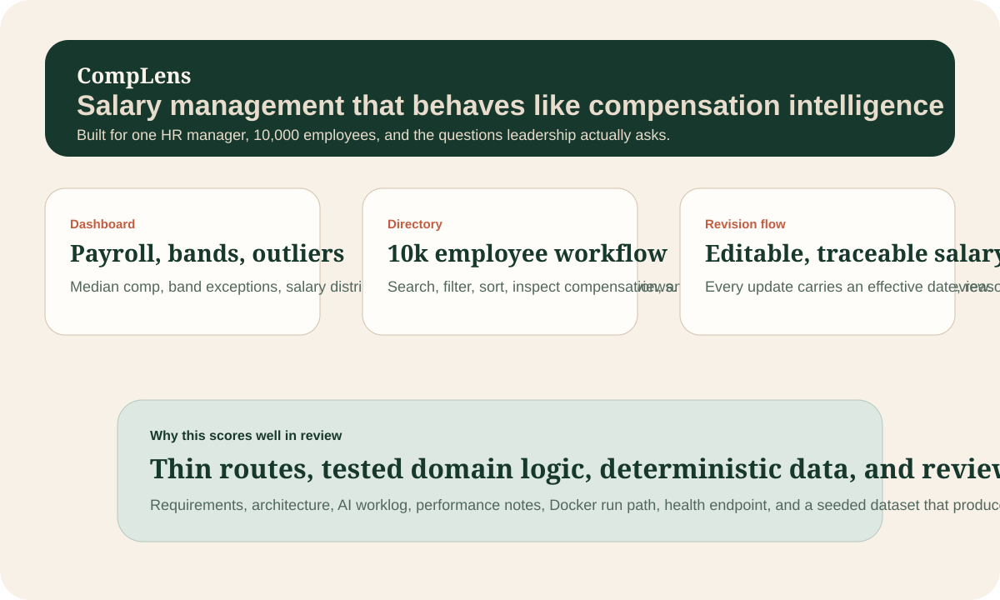

# CompLens

`CompLens` is a full-stack compensation intelligence system for a global HR manager who needs to manage salary data for 10,000 employees and answer questions about how the company pays people.



## Why This Stands Out

This submission is designed to look like a small, credible product rather than a generic assignment:

- Next.js + TypeScript for a single deployable app with both UI and API
- SQLite for deterministic local setup and fast tests
- Seeded 10,000-employee dataset with realistic multi-country compensation
- Versioned compensation records with stock grants and salary history
- Salary-band compliance, compa-ratio, and CSV export for review workflows
- Analytics designed for HR questions, not just CRUD completeness
- A deterministic compensation Q&A interface for common HR questions
- Testable business logic separated from route handlers and UI components

## Reading Order

If you are reviewing quickly, start here:

1. [docs/requirements.md](./docs/requirements.md)
2. [docs/architecture.md](./docs/architecture.md)
3. [docs/reviewer-guide.md](./docs/reviewer-guide.md)
4. [docs/verification.md](./docs/verification.md)
5. [docs/ai-worklog.md](./docs/ai-worklog.md)

## Product Highlights

- Browse, search, filter, and sort `10,000` employees
- Inspect compensation details including salary band and compa-ratio
- Record salary revisions with effective-date tracking and audit-friendly history
- Review payroll distribution, pay equity, band compliance, and compensation outliers
- Export the filtered employee list to CSV
- Ask deterministic compensation questions without needing SQL or an LLM

## Product Scope

The app supports the workflows I believe matter most for the assignment's persona:

- Browse, search, filter, and sort 10,000 employees
- Inspect individual employee compensation details
- Update salary components with effective-date tracking and audit-friendly revision history
- Detect compensation outliers with department-relative z-scores
- Review salary-band compliance and compa-ratio by employee
- Export the current filtered dataset to CSV
- Answer leadership questions through payroll analytics, distribution views, and a smart query interface

What I deliberately did not build is documented in [docs/requirements.md](./docs/requirements.md).

## Tech Stack

- `Next.js 15` with the App Router
- `TypeScript`
- `better-sqlite3`
- `Vitest`
- Hand-rolled UI components and CSS tokens for a distinct visual identity

## Run Locally

```bash
git clone <your-repo-url>
cd Incubyte-sde-assignment
npm install
npm run seed
npm run dev
```

Open `http://localhost:3000`.

## Run With Docker

```bash
docker compose up --build
```

Open:

- App: `http://localhost:3000`
- Health: `http://localhost:3000/api/health`

## Scripts

```bash
npm run dev
npm run build
npm start
npm run seed
npm run test
npm run test:watch
```

## Verification

The core verification commands are:

```bash
npm run test
npm run seed
npm run build
```

Current local results from `June 11, 2026`:

- `npm run seed` rebuilt `10,000` employees and `5,497` salary revisions in about `2.0s`
- `npm run test` passed `10` tests across `7` test files in about `4.4s` wall-clock
- `npm run build` produced a clean production build in about `22.6s` wall-clock

The repository also includes:

- [docs/verification.md](./docs/verification.md)
- [docs/performance.md](./docs/performance.md)
- [docs/deployment.md](./docs/deployment.md)

## Dataset Snapshot

The current deterministic seed produces a review-friendly dataset:

- `10,000` employees
- `5,497` salary revisions
- `9,186` employees within band
- `152` employees under band
- `662` employees over band
- average compa-ratio `102.5%`
- median compa-ratio `102.2%`

## Artifacts

- Requirements: [docs/requirements.md](./docs/requirements.md)
- Architecture notes: [docs/architecture.md](./docs/architecture.md)
- AI collaboration notes: [docs/ai-worklog.md](./docs/ai-worklog.md)
- Reviewer guide: [docs/reviewer-guide.md](./docs/reviewer-guide.md)
- Demo script: [docs/demo-script.md](./docs/demo-script.md)
- Deployment notes: [docs/deployment.md](./docs/deployment.md)
- Submission checklist: [docs/submission-checklist.md](./docs/submission-checklist.md)

## Reviewer Notes

The important design choice here is not "how much UI can I ship" but "what is the smallest product that feels credible for a 10,000-employee org?" My answer is:

- fast local setup
- clear compensation data model
- analytics that answer business questions
- salary-band compliance and compa-ratio visibility
- salary distribution, equity, and anomaly detection
- filtered CSV export for downstream HR review
- change history for salary edits
- tests around the business rules that are easiest to break

## Before Submission

The repo is ready for deployment and demo recording, but I would still complete these final steps before sending it to reviewers:

- deploy the app to a host with persistent disk support
- record a `3-5` minute demo using [docs/demo-script.md](./docs/demo-script.md)
- add the live URL and demo URL to this README
