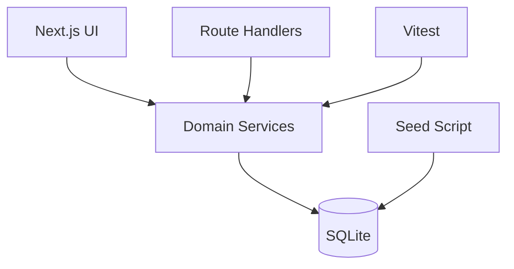

# Architecture Notes

## Overview

This app uses a single Next.js codebase to keep the submission deployable and easy to review.

## Why This Shape

- The assignment explicitly asks for backend and UI. Next.js route handlers satisfy that without monorepo overhead.
- SQLite keeps local setup trivial and test runs fast.
- Domain logic lives in `lib/` so it can be tested without rendering the app or calling HTTP.

## Main Modules

- `lib/db.ts`
  Opens and initializes SQLite safely.
- `lib/employees.ts`
  Employee queries and salary update workflow.
- `lib/analytics.ts`
  Payroll summaries and distribution analytics.
- `lib/validation.ts`
  Centralized input validation for salary updates and filters.
- `app/api/**`
  Thin HTTP layer over the domain services.
- `app/page.tsx`
  Primary HR workflow with dashboard, employee list, and detail pane.

## Key Design Decisions

### 1. Analytics-first product framing

Most submissions will likely stop at CRUD. I intentionally included analytics because the brief says the HR manager should be able to answer questions about how the org pays people.

### 2. Revision history over destructive updates

Salary changes are stored as revisions with reason, actor, and effective date. The employee record is still updated for fast reads, but the historical trail remains queryable.

### 3. Deterministic seeded data

The seed script uses deterministic pseudo-random generation rather than external randomness so reviewers get a stable dataset and reproducible tests.

### 4. Service-first test strategy

The most meaningful tests in this app are not snapshot UI tests. They are:

- filter and pagination correctness
- compensation aggregate correctness
- validation and salary update rules
- revision history creation

## Future Improvements

- authentication and role-aware permissions
- configurable compensation bands by country and level
- CSV import with background validation
- approval workflow for compensation changes
- migration from SQLite to Postgres for multi-user production usage
