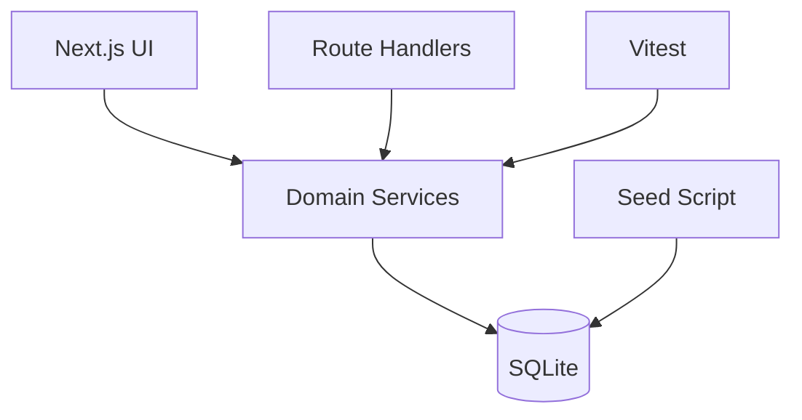

# Architecture Notes

## Overview

This app uses a single Next.js codebase to keep the submission deployable and easy to review.

## Why This Shape

- The assignment explicitly asks for backend and UI. Next.js route handlers satisfy that without monorepo overhead.
- SQLite keeps local setup trivial and test runs fast.
- Domain logic lives in `lib/` so it can be tested without rendering the app or calling HTTP.

## Main Modules

- `lib/db.ts`
  Opens and initializes SQLite safely.
- `app/api/health/route.ts`
  Lightweight deployment and smoke-test endpoint for reviewers.
- `lib/employees.ts`
  Employee queries, pay-band enrichment, and salary update workflow.
- `lib/analytics.ts`
  Payroll summaries, distribution analytics, pay equity, salary-band compliance, and outlier detection.
- `lib/pay-bands.ts`
  Reference salary-band calculations and compa-ratio helpers.
- `lib/csv-export.ts`
  Filtered employee export formatting for downstream review.
- `lib/compensation-questions.ts`
  Intent-based compensation Q&A without depending on an LLM.
- `lib/validation.ts`
  Centralized input validation for salary updates and filters.
- `app/api/**`
  Thin HTTP layer over the domain services.
- `app/page.tsx`
  Primary HR workflow with dashboard, employee list, and detail pane.

## Key Design Decisions

### 1. Analytics-first product framing

Most submissions will likely stop at CRUD. I intentionally included analytics because the brief says the HR manager should be able to answer questions about how the org pays people.

### 2. Revision history over destructive updates

Salary changes are stored as revisions with reason, actor, effective date, and compensation component deltas. The employee record is still updated for fast reads, but the historical trail remains queryable.

### 3. Deterministic seeded data

The seed script uses deterministic pseudo-random generation rather than external randomness so reviewers get a stable dataset and reproducible tests.

### 4. Service-first test strategy

The most meaningful tests in this app are not snapshot UI tests. They are:

- filter and pagination correctness
- compensation aggregate correctness
- compensation question parsing
- outlier detection and distribution logic
- pay-band classification and compa-ratio math
- validation and salary update rules
- revision history creation

### 5. Reference pay bands as explicit product logic

The HR manager does not just need salary storage. They need to know whether compensation is inside or outside an expected range. I modeled pay bands as explicit domain logic derived from country and level, then reused that logic in:

- the employee list
- employee detail views
- analytics
- deterministic Q&A
- CSV export

That keeps reviewer-facing insights consistent across every surface.

### 6. Deployment favors reviewer convenience over platform novelty

I kept the app SQLite-backed because it makes local review and deterministic testing much easier. To avoid hand-waving away deployability, I added a container path and a health endpoint rather than pretending a serverless SQLite setup would be production-friendly.

## Future Improvements

- authentication and role-aware permissions
- editable compensation bands backed by admin-managed reference tables
- CSV import with background validation
- approval workflow for compensation changes
- migration from SQLite to Postgres for multi-user production usage
